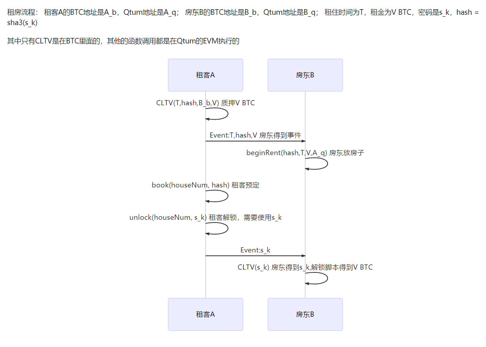
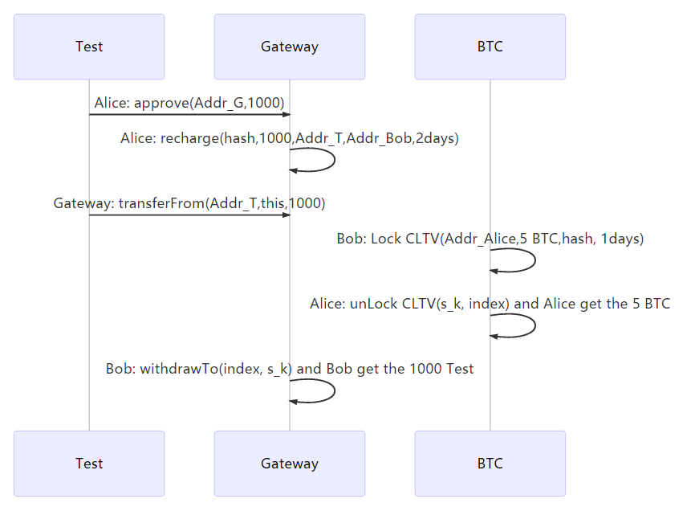

## 租房流程
租客`A` 他的BTC地址是`A_b`, Qtum地址是`A_q`
房东`B` 他的BTC地址是`B_b`, Qtum地址是`B_q`

首先租客和房东已经达成在T时间内租赁房子，付款 `V` BTC
密码 `s_k`， `hash = hash(s_k)`
1、租客`A`输入时间`T`，`hash`, `B_b`，`V`，生成一个CLTV脚本，锁定`V` BTC。
2、房东监听事件，得到`hash`，调用`beginRent`, 输入`price`（`price`并没有参与运算，只是显示价格，所以可以用`V`赋值这个`price`），
   `hash`, `T`
3、租客监听事件，得到总房子数，减一得到`houseNum`，调用`book`函数，输入`houseNum`， `hash`，`T`。
4、租客解锁门锁，输入`s_k`, `houseNum`。
5、房东根据`s_k`在CLTV脚本上得到`V` BTC

## Gateway原子交换步骤（支持Qtum与BTC, ERC20 token, NTF token交换）
现在有一个ERC20 token TOK部署在Qtum上，它的合约地址是`addr`
玩家`A`和玩家`B`商量好了，玩家`A`用1000 TOK 换玩家`B` 10 BTC。
`hash = hash(k)`

1、玩家`A`先调用TOK的合约的`approve`函数，允许Gateway合约地址使用他地址下1000个TOK。
2、玩家`A`调用`recharge`函数，输入`hash`, `1000`, `addr`, 玩家`B`的qtum地址（要转换成16进制），锁定时间`1day`
3、玩家`B`输入时间`T`半天，`hash`, `A`的比特币地址，10 BTC，生成一个CLTV脚本，锁定10 BTC。
4、玩家`A`去解锁那个CLTV脚本，输入`k`，得到10 BTC.
5、玩家`B`得到`k`，调用Gateway的`withdrawTo`，输入`k`，玩家`A`的qtum地址，得到1000 TOK

